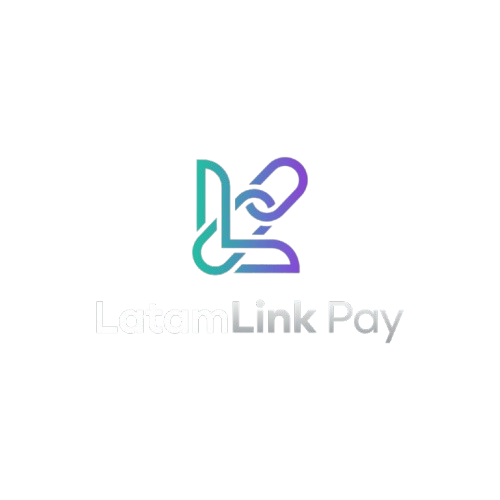
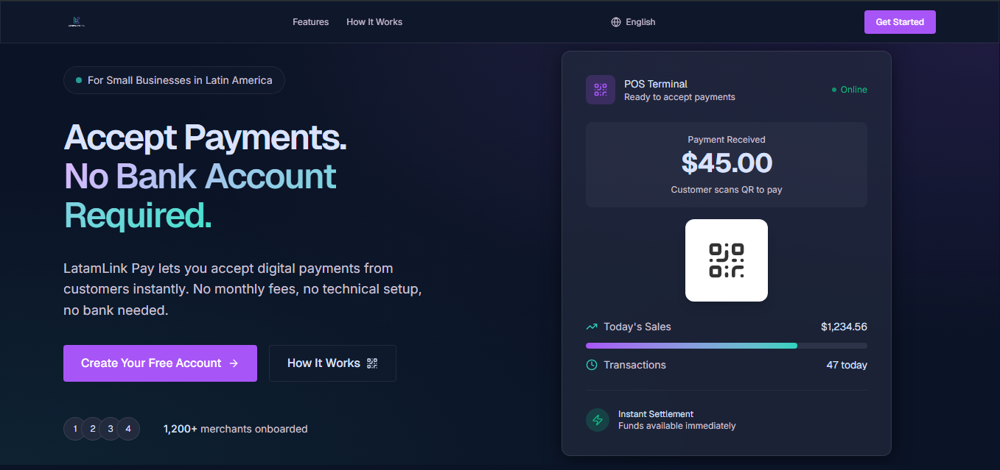
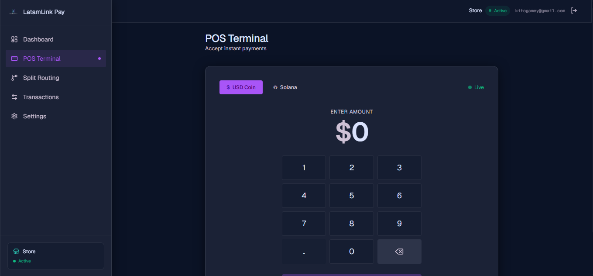
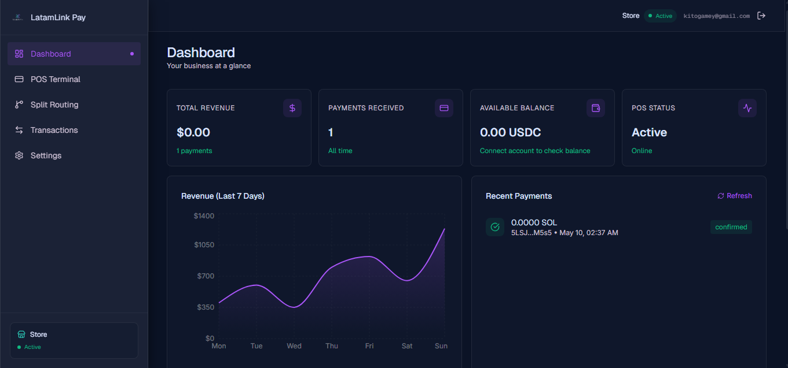

<p align="center">
  
</p>

<h1 align="center">LatamLink Pay</h1>

<p align="center">
  <strong>Your money, at the speed of Solana</strong>
</p>

<p align="center">
  Democratizando los Pagos en Latinoamérica
</p>

<p align="center">
  
  
  
  
  
  
  
  
</p>

---

## Capturas del Producto

| Landing | POS Terminal | Dashboard |
|---------|-------------|-----------|
|  |  |  |

---

## 📋 LatamLink Pay - Documento de Arquitectura y Funcionalidades (v4.0 Final)

---

### 🏗️ Arquitectura del Sistema

```
┌─────────────────────────────────────────────────────────┐
│                    LADO DEL COMERCIO                      │
│  ┌──────────┐    ┌──────────┐    ┌──────────────────┐   │
│  │ Terminal │    │ Tablet/  │    │   Servidor x402  │   │
│  │   POS    │───▶│ Teléfono │───▶│  (API endpoint)  │   │
│  │ físico   │    │ con app  │    │  GET /pay/:id    │   │
│  └──────────┘    └──────────┘    └──────────────────┘   │
│                                                 │        │
│                      ┌──────────────────────────┘        │
│                      ▼                                   │
│           ┌──────────────────┐                           │
│           │   Smart Contract │                           │
│           │  LatamLink Pay   │                           │
│           │   (Solana)       │                           │
│           │ Program ID:      │                           │
│           │ GSeGuv2K3mee...  │                           │
│           └──────────────────┘                           │
└─────────────────────────────────────────────────────────┘
                         │
                         ▼
┌─────────────────────────────────────────────────────────┐
│                 LADO DEL CLIENTE                          │
│  ┌──────────┐    ┌──────────────┐    ┌──────────────┐   │
│  │  QR Code │    │ Solana Pay   │    │   Wallet     │   │
│  │  (x402)  │───▶│  (CLI/MCP)   │───▶│  (Phantom/   │   │
│  │          │    │              │    │   TipLink/   │   │
│  │          │    │              │    │   Privy)     │   │
│  └──────────┘    └──────────────┘    └──────────────┘   │
└─────────────────────────────────────────────────────────┘
```

---

### 🔗 Repositorios y Despliegues

| Componente | Repositorio | URL Producción |
|------------|-------------|----------------|
| **Frontend** | [github.com/anchundiatech/Frontend-latamLink](https://github.com/anchundiatech/Frontend-latamLink) | [frontend-latam-link.vercel.app](https://frontend-latam-link.vercel.app) |
| **Smart Contract** | [github.com/XxHugheadxX/LATAMLINKPAY](https://github.com/XxHugheadxX/LATAMLINKPAY) | Program ID: `GSeGuv2K3meepgSHCehP5jGkRnjRZk96a9vsPSSJ7TjC` |

**Datos del Frontend:**
- **Lenguaje:** TypeScript (96.9%), CSS (2.8%), JavaScript (0.3%)
- **Framework:** Next.js (App Router)
- **Autenticación:** Privy (`@privy-io/react-auth`)
- **Hosting:** Vercel
- **Empaquetador:** pnpm
- **Commits:** 41
- **Colaboradores:** Alejandro Anchundia

---

### 💼 Modelo de Negocio: Dual-Fee Structure

| Capa | Campo | Ejemplo | Destino | Propósito |
|------|-------|---------|---------|-----------|
| **Protocol Fee** | `fee_bps` | 0.5% (50 bps) | `gas_vault` | Subsidiar gas (Gasless) + generar ingresos para LatamLink |
| **POS/Distributor Fee** | `pos_fee_bps` | 1% (100 bps) | Wallet del dueño/distribuidor | Incentivar adopción: el integrador del hardware gana en cada pago |

**Propuesta de valor:** Incluso sumando ambos fees (~1.5%), el costo es **80% menor** que procesadores tradicionales (3.5%-10%) y la liquidación ocurre en **400ms** en lugar de 5 días hábiles.

---

### 🔐 Ecosistema de Herramientas y UX

| Herramienta | Rol | Beneficio |
|-------------|-----|-----------|
| **Privy** | Embedded wallets no-custodiales | El comercio inicia sesión con email/teléfono. No maneja frases semilla. |
| **Privy** | Onboarding simplificado | Wallets sin frase semilla para comercios nuevos |
| **Solana Pay (x402)** | Protocolo de pago HTTP 402 | QR estándar que cualquier wallet puede escanear |
| **Anchor (Rust)** | Framework del smart contract | Validación de cuentas, seguridad, IDL tipado |
| **SPL Token Program** | Manejo de stablecoins | Transferencias nativas de USDC/USDT |
| **Compute Budget Program** | Expansión de CUs | Permite procesar hasta 10 destinos sin abortar |
| **Next.js + Tailwind** | Frontend | Dashboard rápido para el comercio |
| **@solana/web3.js** | Cliente TypeScript | Pruebas e integración |
| **@coral-xyz/anchor** | Cliente Anchor | Lectura de cuentas y envío de instrucciones |

---

### 🏗️ Arquitectura de Cuentas (PDAs)

| Cuenta | Semillas | Tipo | Función |
|--------|----------|------|---------|
| **Merchant** | `["merchant", owner.key(), merchant_id.to_le_bytes()]` | PDA (estado) | Guarda reglas: ID del terminal, token, destinos, porcentajes, fees |
| **Vault** | `["vault", merchant.key()]` | PDA (Token Account) | Bóveda temporal. Recibe el pago y distribuye. Balance final siempre `0` |
| **Gas Vault** | `["gas_vault", merchant.key()]` | PDA (Token Account) | Recauda protocol fee + dust. Para relayer y rentabilidad del protocolo |

**Estructura de la cuenta Merchant:**

| Campo | Tipo | Tamaño | Descripción | Ejemplo |
|-------|------|--------|-------------|---------|
| `owner` | Pubkey | 32 | Dueño del comercio | `7kMmyEQH...` |
| `payment_token_mint` | Pubkey | 32 | Token aceptado | `USDC mint` |
| `merchant_id` | u64 | 8 | ID único numérico | `1` |
| `pos_terminal_id` | String | 4+32 | Nombre flexible del terminal | `"caja-1"` |
| `destinations` | Vec\<Pubkey\> | 4+320 | Hasta 10 cuentas destino | `[ahorro, proveedor]` |
| `percentages` | Vec\<u8\> | 4+10 | Porcentajes (suman 100) | `[50, 50]` |
| `fee_bps` | u16 | 2 | Protocol fee | `50` (0.5%) |
| `pos_fee_bps` | u16 | 2 | Distributor fee | `100` (1%) |
| `min_payment_amount` | u64 | 8 | Pago mínimo | `10_000` |
| `bump` | u8 | 1 | Bump de la PDA | `255` |
| `is_active` | bool | 1 | Kill switch | `true` |
| `total_payments_received` | u64 | 8 | Contador | `42` |
| `total_volume` | u64 | 8 | Volumen total | `1_500_000_000` |

---

### ⚙️ Instrucciones del Smart Contract

#### `initialize_merchant`
Crea las 3 PDAs del comercio.

**Firma corregida para Playground:**
```rust
pub fn initialize_merchant(
    ctx: Context<InitializeMerchant>,
    merchant_id: u64,
    fee_bps: u16,           // protocol fee
    pos_fee_bps: u16,       // distributor fee
    min_payment_amount: u64,
    destinations_count: u8,
    percentages: [u8; 10],  // array fijo de 10
    pos_terminal_id: String, // ⚠️ al final por serialización
) -> Result<()>
```

**Validaciones:**
- Suma de porcentajes = 100 (checked math)
- Sin destinos duplicados
- Fees ≤ 100%
- `pos_terminal_id` no vacío y ≤ 32 chars
- Mints coinciden con `payment_token_mint`

---

#### `pay` (Motor de Enrutamiento Atómico)

```
Flujo de 100 USDC con 1% POS + 0.5% Protocol:

  100.00 USDC (pago del cliente)
  │
  ├─ 1. POS Fee (1%) → 1.00 USDC → pos_fee_destination (dueño/distribuidor)
  │
  ├─ 2. Resto (99 USDC) → transferencia al vault
  │
  ├─ 3. Protocol Fee (0.5% sobre 99) → 0.495 USDC → gas_vault
  │
  ├─ 4. Split del remanente (98.505 USDC)
  │   ├─ Destino 1 (50%) → 49.2525 USDC
  │   └─ Destino 2 (50%) → 49.2525 USDC
  │
  ├─ 5. Dust (residuo) → gas_vault (barrido automático)
  │
  └─ 6. Actualizar contadores + emitir PaymentProcessed
```

**Cuentas requeridas adicionales:**
- `pos_fee_destination` (ATA del owner)
- `payment_token_mint` (para validar mints)
- `destination_0` a `destination_9` (10 cuentas fijas)

**Evento emitido:** `PaymentProcessed` con `pos_terminal_id`, `amount`, `pos_fee`, `gas_fee`, `dust`, `split_amounts`, `timestamp`.

---

#### Otras instrucciones

| Instrucción | Acceso | Función |
|-------------|--------|---------|
| `update_config` | Solo owner | Modifica fees, porcentajes y destinos |
| `toggle_merchant_active` | Solo owner | Kill switch para pausar cobros |
| `withdraw_gas_fees` | Solo owner | Retirar liquidez del gas_vault |

---

### 🧠 Ingeniería Avanzada y Optimizaciones

| Optimización | Problema que resuelve | Implementación |
|--------------|----------------------|----------------|
| **`Box<T>` en cuentas** | Stack Overflow (>4096 bytes) | Las cuentas grandes van al Heap, solo punteros de 8 bytes en Stack |
| **`CpiContext::new_with_signer`** | Firma trustless de transfers | El contrato firma por sí mismo con seeds PDA + bump |
| **`checked_mul/div`** | Overflow aritmético | Todas las operaciones con u128 previenen desbordamientos |
| **Dust Sweeping** | Fondos estancados | Barrido automático de residuos al gas_vault |
| **Arrays fijos `[u8; 10]`** | Errores de serialización en Playground | Evita `Blob.encode` errors con Vec dinámicos |
| **`#[derive(InitSpace)]`** | Cálculo inseguro de espacio | El compilador calcula el espacio exacto de la cuenta |
| **Compute Budget** | Límite de CUs por transacción | Aumenta el límite para procesar hasta 10 destinos |

---

### 🧪 Suite de Pruebas (6 tests)

| # | Test | Resultado esperado |
|---|------|-------------------|
| 1 | Inicializar comercio | Merchant activo con `pos_terminal_id = "caja-1"`, gas=0.5%, pos=1% |
| 2 | Pago de 100 USDC | POS: 1.0, Gas: 0.495, Dest1: 49.2525, Dest2: 49.2525 |
| 3 | Pago < mínimo | Error `MinPaymentRequired` |
| 4 | Comercio inactivo | Error `MerchantInactive` |
| 5 | Retiro de gas | Gas vault vacío, owner recibe fondos |
| 6 | Actualizar config | Nueva configuración reflejada on-chain |

---

### 🔒 Seguridad

| Protección | Implementación |
|------------|----------------|
| PDA única por comercio | Seeds: `["merchant", owner, merchant_id.to_le_bytes()]` |
| Solo owner modifica config | `has_one = owner` |
| Suma de % = 100 | `checked_add` + `require!(sum == 100)` |
| Destinos duplicados | Búsqueda O(n²) para n≤10 |
| Dust → gas_vault | Sin fondos bloqueados permanentemente |
| Kill switch | `is_active` toggle |
| Validación de mints | Todos los destinos deben ser del mismo token |
| Autoridad del vault | Solo el programa firma (CPI con seeds) |
| Anti-overflow | `checked_mul/div/add/sub` en todas las operaciones |
| Stack safety | `Box<T>` en contextos con >4 cuentas |

---

### 📊 Ejemplo Real: Cafetería "Doña María"

```
Doña María configura su POS en 2 minutos (con Privy, solo usa su email):
- Terminal: "caja-1"
- Token: USDC
- Protocol fee: 0.5% (cubre gas + ingreso LatamLink)
- POS fee: 1% (ganancia de Doña María)
- Split: 50% ahorro, 50% proveedor de café

Cliente compra café por 10 USDC:
  10.00 USDC
  ├── POS fee (1%)         → 0.10 USDC → Wallet de Doña María ✅
  ├── Protocol fee (0.5%)  → 0.05 USDC → gas_vault ✅
  └── Split (98.5%)
      ├── Ahorro (50%)     → 4.925 USDC → Cuenta de ahorro ✅
      └── Proveedor (50%)  → 4.925 USDC → Cuenta del proveedor ✅

✅ Comisión total: 1.5% vs 5% del banco
✅ Liquidación: instantánea vs 5 días
✅ Doña María nunca tocó SOL ni frases semilla
```

---

### 📈 Stack Tecnológico

| Capa | Tecnología |
|------|------------|
| **Blockchain** | Solana (devnet) |
| **Smart Contract** | Anchor (Rust) - `GSeGuv2K3meepgSHCehP5jGkRnjRZk96a9vsPSSJ7TjC` |
| **Frontend** | Next.js + TypeScript + Tailwind CSS |
| **Autenticación** | Privy (`@privy-io/react-auth`) |
| **Hosting** | Vercel |
| **IDL** | Generado por Anchor |
| **Estándar de pago** | x402 / MPP (HTTP 402) |
| **Cliente CLI** | Solana Pay (Rust) |
| **Wallets soportadas** | Phantom, Solflare, TipLink, Privy |
| **Tokens soportados** | USDC, PYUSD, USDT (SPL) |
| **Testing** | Solana Playground + TypeScript |

---

### 🌐 Integración con Solana Pay (x402)

**Solana Pay** ([github.com/solana-foundation/pay](https://github.com/solana-foundation/pay)) es el CLI oficial que:
- Detecta HTTP 402 en llamadas API
- Soporta protocolos **x402** y **MPP**
- Prepara transacciones con stablecoins
- Solicita firma biométrica (Touch ID / Windows Hello)
- Funciona con AI agents (Claude, Codex) vía MCP

**Endpoint x402 que expondrá LatamLink Pay:**
```json
GET https://api.latamlink.io/pay/{merchant_pda}

Respuesta HTTP 402:
{
  "network": "solana",
  "address": "GSeGuv2K3meepgSHCehP5jGkRnjRZk96a9vsPSSJ7TjC",
  "mint": "<usdc_mint>",
  "amount": "100.00",
  "splits": [
    { "destination": "<cuenta_ahorro>", "percentage": 50 },
    { "destination": "<cuenta_proveedor>", "percentage": 50 }
  ],
  "posFeeBps": 100,
  "gasFeeBps": 50,
  "label": "Cafetería Latam - Caja 1"
}
```

---

### 🛣️ Roadmap

| Fase | Estado | Entregables |
|------|--------|-------------|
| **Smart Contract** | ✅ Completado | `lib.rs` + 6 pruebas en Playground |
| **Frontend base** | ✅ Completado | Next.js + Privy + Vercel (41 commits) |
| **Endpoint x402** | 🔜 Pendiente | Servidor HTTP que lee on-chain y responde HTTP 402 |
| **Dashboard** | 🔜 Pendiente | Historial de pagos, balances, retiros |
| **Integración Anchor** | 🔜 Pendiente | Conectar frontend con IDL y program ID |
| **QR x402** | 🔜 Pendiente | Generación de QR estándar para Solana Pay |
| **Relayer de gas** | 🔜 Pendiente | Servicio que retira gas_vault y paga SOL |
| **Testing e2e** | 🔜 Pendiente | 3 wallets Phantom reales en devnet |
| **Auditoría** | 🔜 Pendiente | Revisión externa de seguridad |
| **Mainnet** | 🔜 Pendiente | Despliegue en Solana mainnet |

---

### 👥 Equipo

| Miembro | GitHub | Rol |
|---------|--------|-----|
| **Alejandro Anchundia** | [anchundiatech](https://github.com/anchundiatech) | Founder & Lead Dev |
| **William Yucra** | - | Co-Founder & Smart Contract Engineer |
| **Victor Sanchez** | - | Backend Engineer |

---

<p align="center">
  
  <br />
  <strong>Your money, at the speed of Solana</strong>
  <br />
  Democratizando los Pagos en Latinoamérica
</p>